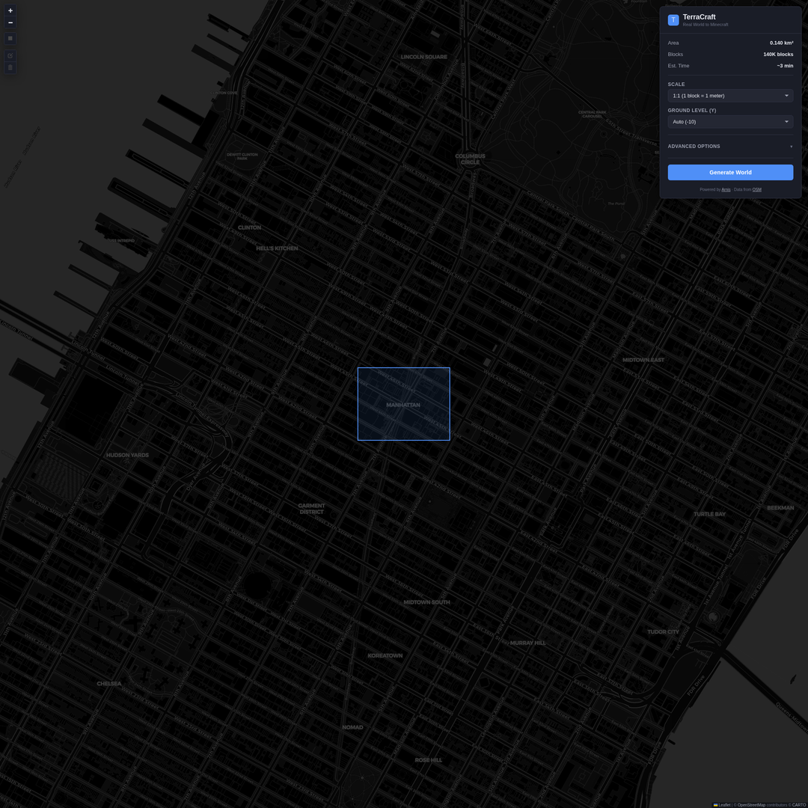
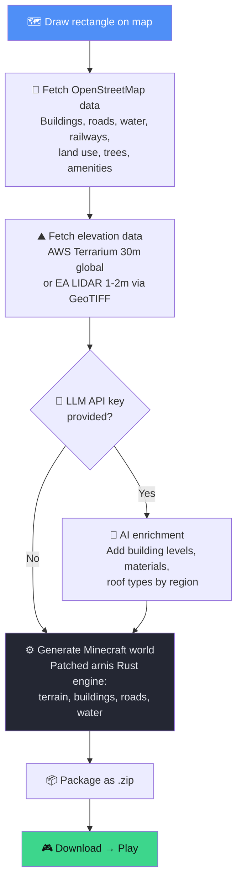
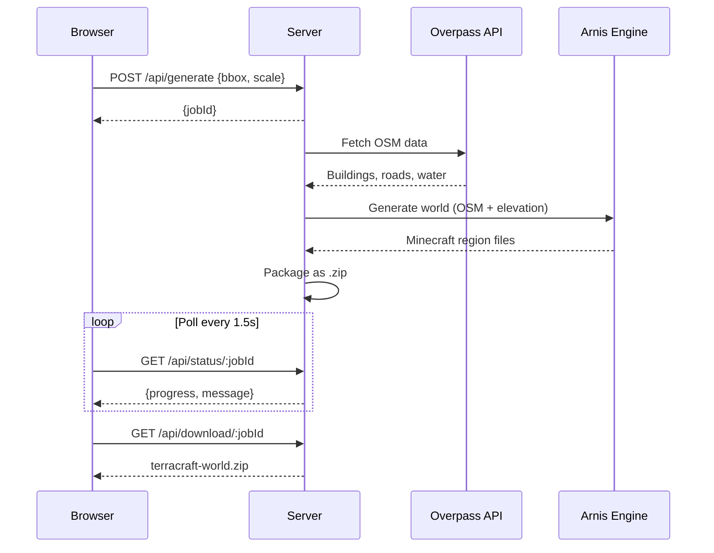
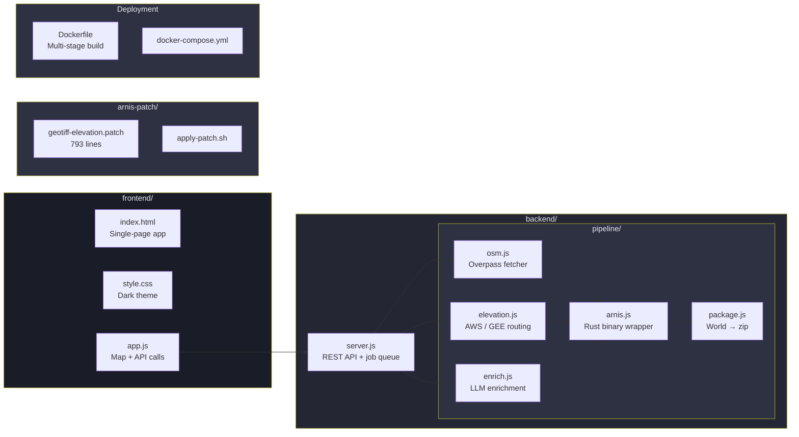

<p align="center">
  
</p>

<h1 align="center">TerraCraft</h1>
<p align="center"><strong>Turn any place on Earth into a playable Minecraft world.</strong></p>

<p align="center">
  <a href="#quick-start">Quick Start</a> · <a href="#how-it-works">How It Works</a> · <a href="#features">Features</a> · <a href="#api">API</a> · <a href="#credits">Credits</a>
</p>

---

Select a rectangle on the map. Click generate. Download a Minecraft Java Edition world with real buildings, roads, rivers, terrain, and 290+ block types — sourced from OpenStreetMap and satellite elevation data. Drop it into your `saves/` folder and explore.

No Minecraft modding required. Works with vanilla clients, PaperMC, Spigot, and any 1.18+ server.

## Quick Start

```bash
git clone https://github.com/DreamLab-AI/terracraft.git
cd terracraft
docker compose up --build
```

Open **http://localhost:3000**. Draw a rectangle anywhere in the world. Click **Generate World**. Download the zip. Play.

### Without Docker

```bash
# Requires: Node.js 18+, arnis binary on PATH
cd backend && npm install && cd ..
ARNIS_BIN=/path/to/arnis PORT=3000 node backend/server.js
```

## How It Works



## Features

**Map Interface**
- Global drag-and-drop rectangle selection on dark CARTO basemap
- Real-time area, block count, and generation time estimates
- Scale selector: 1:1, 1:2, 1:4, 1:10 (default)
- Configurable ground level for different terrain types
- Mobile-responsive dark theme

**World Generation**
- Real terrain from elevation data (AWS Terrarium globally, EA LIDAR for UK at 1-2m)
- 290+ buildings with walls, doors, windows, roofs, and interiors
- Roads, highways, railways, bridges
- Rivers, lakes, water bodies
- Land use zones: farmland, forest, meadow, residential
- Trees with species detection from OSM tags

**Scale-Aware Feature Rendering**
- At smaller scales (1:4, 1:10), roads, rivers, and railways are guaranteed to remain visible
- Major roads (motorway, primary, secondary) render at minimum 2 blocks wide
- Minor roads, footpaths, and tracks render at minimum 1 block wide
- Rivers and canals scale proportionally with a minimum of 2 blocks
- Streams, ditches, and drains scale to minimum 1 block
- Railways and barriers (walls, fences, hedges) are always 1 block — no minimum needed

**Server & Pipeline**
- 1.18+ chunk format — works with PaperMC, Spigot, vanilla
- Job queue with configurable concurrency (default: 2 parallel)
- Auto-cleanup of generated worlds after 1 hour
- RESTful API for headless/automated generation
- Self-contained Docker image (arnis compiled from source)

**AI Enrichment** (optional)
- Provide an OpenAI or Google Gemini API key
- LLM analyses the selected region and enriches building metadata
- Adds contextually accurate `building:levels`, `building:material`, `roof:shape`, `roof:material`
- Victorian stone in the Lake District, brownstone in Brooklyn, timber in Scandinavia

## API



### `POST /api/generate`

Start world generation.

```json
{
  "bbox": [40.756, -73.988, 40.760, -73.983],
  "scale": 1.0,
  "groundLevel": -10,
  "spawnLat": 40.758,
  "spawnLng": -73.9855,
  "llmKey": "sk-...",
  "llmProvider": "openai"
}
```

**Response:** `{ "jobId": "uuid", "areaKm2": 0.14, "blockEstimate": 140485 }`

### `GET /api/status/:jobId`

Progress (0–100%), status (`queued` | `running` | `complete` | `failed`), current step.

### `GET /api/download/:jobId`

Download the generated world as `terracraft-world-XXXXXXXX.zip`.

### `DELETE /api/jobs/:jobId`

Clean up a job and its files.

### `GET /api/health`

`{ "status": "ok", "activeJobs": 0, "queuedJobs": 0 }`

## Configuration

| Variable | Default | Description |
|----------|---------|-------------|
| `PORT` | `3000` | Server port |
| `ARNIS_BIN` | `/usr/local/bin/arnis` | Path to arnis binary |
| `MAX_AREA_KM2` | `25` | Maximum selectable area in km² |
| `MAX_CONCURRENT` | `2` | Parallel generation jobs |
| `CLEANUP_HOURS` | `1` | Auto-delete completed jobs after N hours |
| `GEMINI_API_KEY` | — | Google Gemini key for AI building enrichment |
| `OPENAI_API_KEY` | — | OpenAI key for AI building enrichment |
| `GEE_PROJECT` | — | Google Earth Engine project ID (for LIDAR) |

## Arnis Patches

TerraCraft includes a 793-line patch to the upstream [arnis](https://github.com/louis-e/arnis) Minecraft generator, adding:

| Patch | What it does |
|-------|-------------|
| **GeoTIFF elevation** | `--elevation-file` flag accepts local DEM files (Float32/64, Int16/U16) |
| **Raw TIFF tag parser** | Reads ModelPixelScale + ModelTiepoint directly from binary, bypassing crate limitations |
| **WGS84 → BNG transform** | Approximate Helmert projection for UK Ordnance Survey LIDAR data |
| **1.18+ chunk format** | Removes `Level` wrapper, adds `DataVersion=4189`, `Status=minecraft:full`, `yPos` — required for PaperMC |
| **Terrain flag fix** | `--elevation-file` implies `--terrain` so buildings register to elevation correctly |
| **Minimum feature widths** | Roads, rivers enforce minimum block widths at small scales so they don't vanish at 1:10 |

Apply manually:

```bash
./arnis-patch/apply-patch.sh /path/to/output
cd /path/to/output && cargo build --no-default-features --release
```

## Architecture



## Choosing a Scale

| Scale | Use case | 2km × 2km area | View distance | Detail |
|-------|----------|----------------|---------------|--------|
| **1:1** | Architectural detail, single building | 2000 × 2000 blocks | 27 min walk | Every wall, window, kerb |
| **1:2** | Neighbourhood exploration | 1000 × 1000 blocks | 14 min walk | Buildings recognisable |
| **1:4** | Village / small town | 500 × 500 blocks | 7 min walk | Good buildings, roads clear |
| **1:10** | Landscape, valleys, coastline **(default)** | 200 × 200 blocks | 3 min walk | Terrain, roads, rivers visible |

**1:10 is the default** because it produces compact, server-friendly worlds where you can see the whole landscape. Roads, railways, rivers, and walls are guaranteed to remain visible thanks to minimum-width enforcement. Buildings become 1–2 block structures at this scale — recognisable landmarks rather than detailed interiors.

For detail work (e.g. recreating a single street), use 1:1 or 1:2 with a small selection area.

## Known Limitations

- **Overpass API rate limits** — very large areas may need multiple retries or a local OSM extract
- **AWS Terrarium resolution** — 30m globally; for higher fidelity, provide a custom GeoTIFF via the API
- **Building interiors** — generated procedurally, not architecturally accurate
- **Trees** — placed as schematic structures based on OSM tags, not biome-aware
- **Older Minecraft** — only 1.18+ is supported (modern chunk format)
- **No Bedrock Edition** — Java Edition only (Bedrock support is possible via arnis but not exposed in the UI)

## Credits & Acknowledgements

This project builds on the work of many open-source contributors and data providers:

| Project | Contribution | Licence |
|---------|-------------|---------|
| [**Arnis**](https://github.com/louis-e/arnis) by Louis E | Core Minecraft world generation engine | Apache 2.0 |
| [**OpenStreetMap**](https://www.openstreetmap.org) | Building, road, water, and land use data | ODbL |
| [**AWS Terrain Tiles**](https://registry.opendata.aws/terrain-tiles/) | Global elevation data (Terrarium format) | Public domain |
| [**Environment Agency LIDAR**](https://environment.data.gov.uk/survey) | UK 1-2m resolution DTM/DSM | Open Government Licence |
| [**Google Earth Engine**](https://earthengine.google.com/) | LIDAR and satellite data access | Terms of Service |
| [**Leaflet.js**](https://leafletjs.com/) | Interactive map library | BSD-2-Clause |
| [**Leaflet.draw**](https://github.com/Leaflet/Leaflet.draw) | Rectangle drawing plugin | MIT |
| [**CARTO**](https://carto.com/) | Dark basemap tiles | CC BY 3.0 |
| [**GDAL**](https://gdal.org/) | Geospatial data processing | MIT |
| [**PaperMC**](https://papermc.io/) | Target server platform | GPL-3.0 |
| [**DreamLab AI**](https://github.com/DreamLab-AI) | Pipeline architecture, GeoTIFF patch, building enrichment system | — |
| [**Claude Flow**](https://github.com/ruvnet/claude-flow) by ruv | AI agent orchestration framework used during development | Apache 2.0 |

## Licence

Apache 2.0 — see [LICENSE](LICENSE) for details.

The arnis patches are offered under the same Apache 2.0 licence as upstream arnis.
